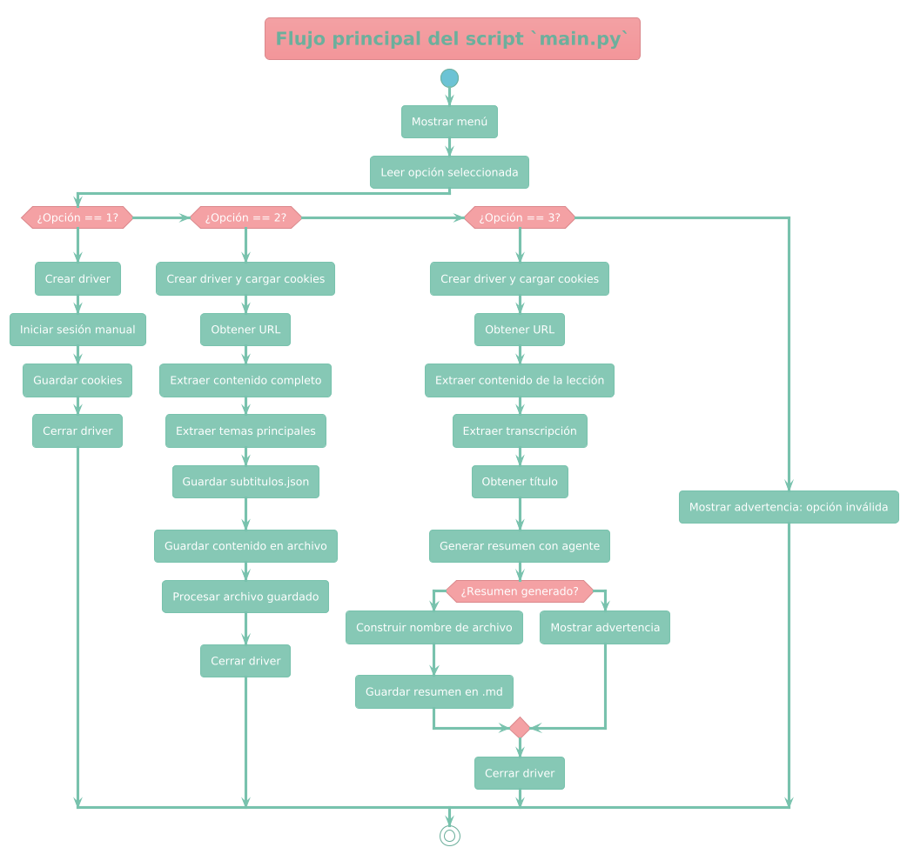

# 📘 Proyecto: Descarga, Limpieza y Resumen de Lecciones Coursera

Este proyecto automatiza la descarga de lecciones desde Coursera usando Selenium, limpia el contenido HTML, lo transforma en archivos Markdown jerárquicos, permite generar prompts y ahora también resume automáticamente las lecciones utilizando modelos de lenguaje.

---

## 🚀 ¿Qué hace este proyecto?

- Inicia sesión manual en Coursera y guarda cookies reutilizables.
- Descarga el contenido visible de una lección desde su URL.
- Elimina elementos molestos como botones, instrucciones redundantes y traducciones automáticas.
- Extrae automáticamente el título de la lección en español o inglés.
- Limpia y estructura la transcripción principal del video.
- Genera un resumen automático del contenido extraído.
- Aplica jerarquía Markdown (`##`, `###`) con base en subtítulos.
- Permite la edición manual del archivo jerarquizado.
- Genera scripts `.sh` con nombres jerárquicos para crear archivos fácilmente.
- Crea prompts Markdown a partir de cada tema/subtema procesado.

---

## 🧰 Requisitos

- Python 3.8 o superior
- Google Chrome + ChromeDriver
- Archivo `.env` con la clave de API de OpenAI:

```env
OPENAI_API_KEY=sk-...
```

### 📦 Instalación de paquetes

```bash
pip install -r requirements.txt
```

Incluye:
- `selenium`
- `openai`
- `python-dotenv`

---

## 🧑‍💻 ¿Cómo se usa?

Ejecuta el script principal:

```bash
python main.py
```

Selecciona una opción:

1. Guardar cookies (inicia sesión manualmente)
2. Extraer y procesar contenido jerárquico
3. Extraer, limpiar y generar resumen de la lección

---

## 📋 Flujo de procesamiento completo

### 🔹 Opción 2 – Procesamiento

1. Extrae el contenido `<main>` desde Coursera.  
2. Elimina contenido irrelevante (controles, botones, etc.).  
3. Extrae subtítulos principales.  
4. Aplica jerarquía Markdown.  
5. Permite edición manual del archivo.  
6. Genera un script `.sh` con nombres jerárquicos, por ejemplo:

```bash
3a1_Tema.md
3a1a_Subtema.md
```

7. Genera archivos `.md` tipo prompt.

---

### 🔹 Opción 3 – Resumen

1. Extrae el contenido y transcripción desde `<main>`.  
2. Detecta automáticamente el título de la lección.  
3. Envía el contenido limpio al modelo de OpenAI.  
4. Genera y guarda un archivo `.md` como:

```
resumenes_generados/resumen_Writing_the_Script_2025-05-02_230152.md
```

---

## 📂 Estructura del proyecto

```
descarga_info/
├── main.py                            ← Script principal (menú y orquestación)
├── coursera_utils.py                 ← Extracción HTML, manejo de cookies, Selenium
├── flujo_procesamiento.py           ← Limpieza, jerarquía, generación .sh
├── procesador_archivo_md.py         ← Limpieza y reestructuración Markdown
├── genera_prompts_desde_archivo.py  ← Crea prompts por sección
├── generador_script_nombres.py      ← Genera scripts .sh jerárquicos
├── procesar_texto_leccion.py        ← Limpia transcripción y extrae títulos
├── agentes/
│   └── agente_resumidor.py          ← Llama a OpenAI para generar resúmenes
├── config.py                        ← Rutas de carpetas (`CARPETA_RESUMENES`)
├── salida_descarga/                 ← Contenido crudo descargado
├── salida_procesados/               ← Contenido limpio sin jerarquía
├── salida_limpia/                   ← Contenido jerarquizado final
├── salida_crea_archivos/            ← Script `.sh` para crear archivos
├── prompts_generados/               ← Archivos `.md` tipo prompt
├── resumenes_generados/             ← Resúmenes automáticos en Markdown
└── subtitulos.json                  ← Define jerarquía de encabezados
```

---

## 🖼️ Diagrama visual del flujo




---

## 🛡️ Licencia

Uso libre para fines personales, educativos o de investigación.

---

## 🤝 Contribuciones

¡Pull requests, mejoras, ideas y comentarios son bienvenidos!
