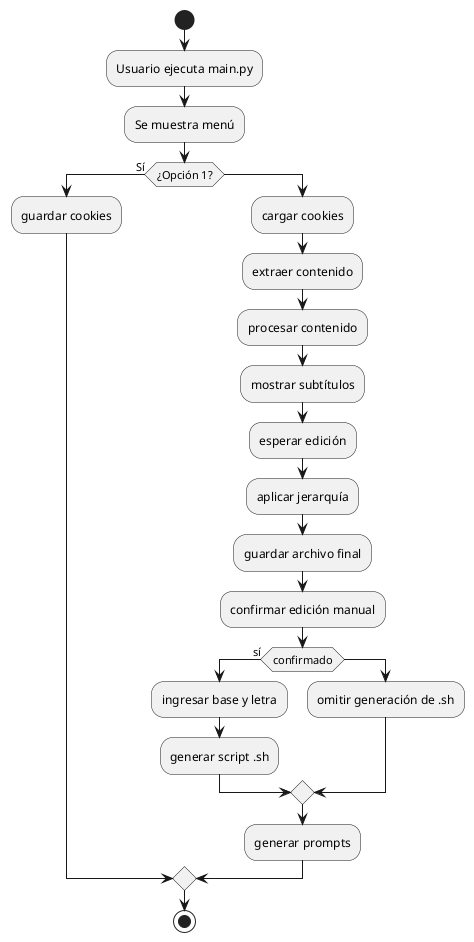

# 📘 Proyecto: Descarga y Generación de Prompts desde Coursera

Este proyecto automatiza la descarga de lecciones de Coursera usando Selenium, limpia el contenido para estructurarlo en Markdown jerárquico y genera archivos `.md` listos para ser usados como prompts o material de estudio. Además, permite generar scripts `.sh` con nombres estructurados para facilitar la creación de archivos en lote.

---

## 🚀 ¿Qué hace este proyecto?

1. Inicia sesión manual en Coursera y guarda cookies.
2. Descarga contenido limpio de una lección desde una URL.
3. Elimina basura visual como botones, instrucciones redundantes o calificaciones.
4. Aplica jerarquía Markdown con `##` y `###` en base a subtítulos definidos.
5. Permite editar manualmente el archivo jerarquizado generado.
6. Muestra el contenido actualizado y confirma si fue modificado correctamente.
7. Genera un archivo `.sh` con nombres jerárquicos basados en los temas y subtópicos.
8. Genera prompts en formato Markdown listos para usarse o completarse.

---

## 🧰 Requisitos

- Python 3.8+
- Google Chrome
- ChromeDriver (instalado y accesible desde el PATH)
- Paquetes Python:
  - selenium

Instala las dependencias:

```bash
pip install -r requirements.txt
```

---

## 🧑‍💻 ¿Cómo usarlo?

Ejecuta el script principal:

```bash
python main.py
```

Elige una opción:

1. Iniciar sesión manual en Coursera y guardar cookies.
2. Usar cookies y pegar la URL de una lección para procesarla.

---

## 📋 Flujo de procesamiento completo

1. Se descarga el contenido de la lección como `.md`.
2. Se limpia automáticamente (eliminando texto irrelevante).
3. Se aplica una jerarquía Markdown con encabezados `##` y `###`.
4. Se guarda un archivo jerarquizado editable (`salida_limpia/`).
5. El sistema pausa para permitir edición manual del archivo jerarquizado.
6. Se muestra el contenido actualizado en consola.
7. Si el usuario confirma la edición:
   - Se solicita un identificador numérico y letra de módulo.
   - Se genera automáticamente un archivo `.sh` con nombres jerárquicos tipo:
     ```
     3a1_Antes_de_Control_de_version.md
     3a1a_Introduccion_al_modulo.md
     ...
     ```
   - El `.sh` se guarda en la carpeta `salida_crea_archivos/` con nombre derivado del módulo, por ejemplo:
     ```
     introduccion_al_control_de_versiones.sh
     ```

8. Finalmente, se generan automáticamente los prompts `.md` para cada tema y subtópico, guardados en `prompts_generados/`.

---

## 🧱 Estructura del proyecto

```
descarga_info/
├── main.py                       ← Script principal
├── coursera_utils.py            ← Login, cookies, extracción con Selenium
├── flujo_procesamiento.py       ← Orquesta limpieza + jerarquía + generación
├── procesador_archivo_md.py     ← Limpieza y estructura Markdown
├── genera_prompts_desde_archivo.py ← Genera prompts desde Markdown jerarquizado
├── generador_script_nombres.py  ← Genera .sh con nombres jerárquicos
├── salida_descarga/             ← Archivos descargados crudos
├── salida_procesados/           ← Contenido limpio sin jerarquía
├── salida_limpia/               ← Contenido jerarquizado final
├── salida_crea_archivos/        ← Script .sh para crear archivos jerárquicos
├── prompts_generados/           ← Archivos .md tipo prompt
└── subtitulos.json              ← Define los encabezados que marcan jerarquía
```

---

## 📊 Diagrama del flujo del sistema



---

## 🛡️ Licencia

Este proyecto es de uso libre para fines educativos o personales.

---

## 🤝 Contribuciones

¡Sugerencias, mejoras o pull requests son bienvenidos!
