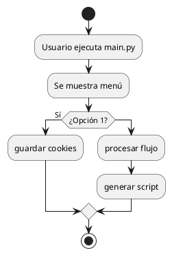

# 📌 Cheat Sheet: Crear y Usar Diagramas con PlantUML

## ✅ Objetivo

Generar diagramas de flujo desde texto plano usando PlantUML y agregarlos a tu proyecto como imágenes (.png) referenciadas en el README.

---

## 1️⃣ Escribe tu diagrama en código PlantUML

Ejemplo:



Guarda este contenido en un archivo, por ejemplo:

```bash
diagrama_sistema.puml
```

---

## 2️⃣ Abre la app de PlantUML Online

🔗 Ve a: [https://www.plantuml.com/plantuml/](https://www.plantuml.com/plantuml/)

📌 Pega tu código PlantUML en el editor  
📥 Descarga la imagen como `.png`  
💾 Nómbrala, por ejemplo: `diagrama_flujo.png`

---

## 3️⃣ Crea una carpeta en tu proyecto para las imágenes

```bash
mkdir docs
```

Guarda la imagen descargada dentro:

```
docs/diagrama_flujo.png
```

---

## 4️⃣ Referencia la imagen en el README.md

Agrega esto en la parte del diagrama:

```markdown
## 🖼️ Diagrama visual del sistema


```

---

## 📁 Estructura final esperada

```
descarga_info/
├── README.md
├── docs/
│   └── diagrama_flujo.png
```

---

